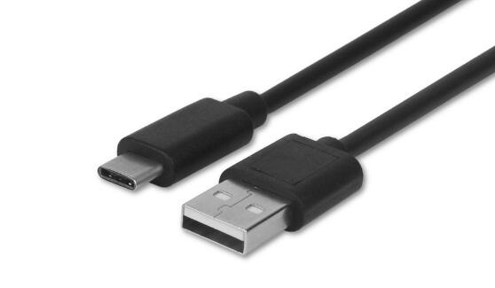
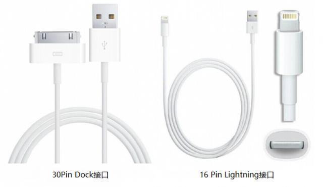
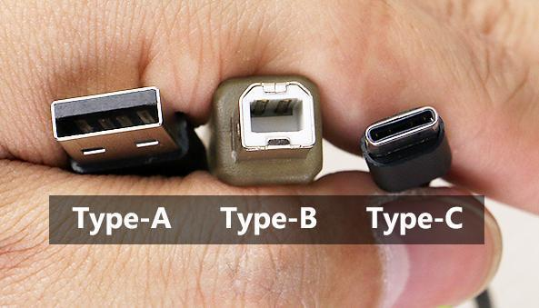

### 移动设备数据线

- **USB Type-C** 
> 特点：
>
> * 支持正反插，不用担心插错方向
> * 最高可支持100W功率传输，充电更快，而且支持双向供电
> * 支持USB3.1标准，数据传输速率更快，最高可达到10Gbps，还可以将音频解码到耳机中。

- **Micro USB ** 

- **APPLE 数据线 - Dock 与 Lightning (闪电)**

#### 延伸阅读

##### **USB Type-A (Standard-A),  Type-B (Micro-B),  Type-C** 

* 标准的 Type-A 是电脑、电子配件中最广泛的介面标准，鼠标、U盘、数据线上大的一方都是此接口，体积也最大。Type-A接口的英文名称就是“Standard Type-A USB”，这说明它是标准的USB接口，而其它形状的USB接口都是它的衍生物。
* Type-B 标准主要应用于打印机、树莓派等设备，较少见

