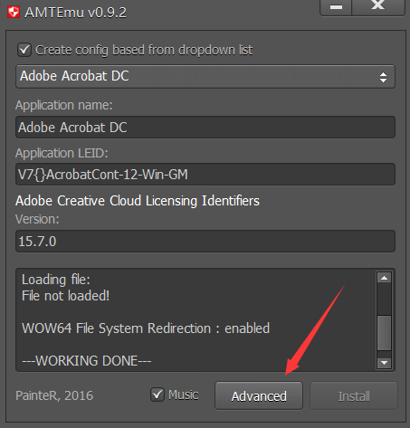

### Adobe系列

准备：

1. Adobe软件（`D:\软件\Adobe全家桶`）
2. amtemu破解工具（`D:\软件\Adobe全家桶`）

步骤：

1. 拷贝所需的Adobe软件文件夹或压缩包到个人电脑上，进行安装，此步骤安装过程略去（就是一直按下一步下一步）
2. 软件安装完成之后，打开amtemu破解工具，选择对应的软件版本（即选择你安装的那款软件）

  

  

3. 在C盘。。。。找到.ddl文件选中之后，点击`Advanced`进行替换即可

  
  
  

说明：
  最大的问题应该还是在于找不到替换文件，如果实在按本文方式找不到，可以问问其他筒子

