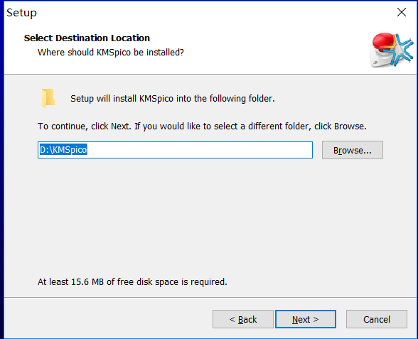
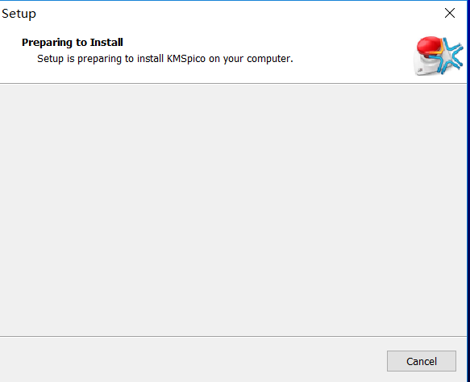
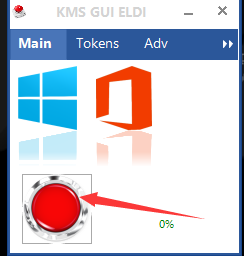
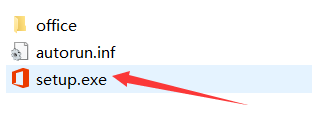

### Windows10及Office的激活（KMS_Pico）

KMS（Key Management Service） ：激活office2016和windows10的工具

#### Windows10 激活

准备：

- KMS激活工具

步骤：

1. 到应维资料机上（`D:\软件\系统工具集`）进行拷贝至个人U盘
2. 双击打开软件
3. 弹窗提示“是否运行软件运行”，选择“是”
4. 点击`Next`-->选择`I accept the agreement`，点击`Next`-->记住`Browse...`里面的地址，点击`Next`-->点击`Next`-->等待-->点击`Finish`退出
    
    
    
    
    

5. 之后，找到KMS的安装路径，比如这里是`D:\KMSpico` 。双击打开图标，点击红色按钮，便可以激活windows10和office2016

#### Office2016

办公必备（家园统一使用Office2016），在家园内部不使用wps。

准备：

1. office2016的镜像（`D:\软件\Office2007-2016`）
2. KMS激活工具（`D:\软件\系统工具集`）

步骤：

1. 将软件拷贝到个人U盘上
2. 双击打开office2016镜像
    
3. 点击setup就开始自动安装了，稍等一段时间之后，就安装完成了

  

4. 安装KMS激活工具并激活——步骤见上

安装失败的原因：

   原来的office未卸载干净

解决办法：

   最快最方便的方法：重装系统。其他方法较为繁琐且具有一定安全性，在此不做介绍，可百度谷歌查找解决办法

#### Office 2010

这里推荐使用一款名为 mini-KMS_Activator_v1.2_Office2010 的软件，可在百度搜索得到，也可在应维机中找到。