## Windows10 激活

### 方法一：KMS 脚本激活（轻巧无毒，但是有效期90天限制）

#### 准备工具

- KMS 激活脚本

#### 步骤

1. 到应维资料机上（`D:\软件\系统工具集`）拷贝 ( `KMS激活脚本.zip`) 至个人U盘  
2. 右键解压至当前目录，进入解压后的文件夹，右键 以管理员身份运行 (`KMS-VL-ALL.cmd`)   
3. 激活有效期为 90 天，90天后需再次运行

### 方法二：KMS Pico 激活 （永久激活，但个别杀软可能报毒）

#### 准备工具

- KMS Pico（Key Management Service)

#### 步骤：

1. 到应维资料机上（`D:\软件\系统工具集`）拷贝至个人U盘
2. 双击打开软件
3. 弹窗提示“是否运行软件运行”，选择“是”
4. 点击`Next`-->选择`I accept the agreement`，点击`Next`-->记住`Browse...`里面的地址，点击`Next`-->点击`Next`-->等待-->点击`Finish`退出
    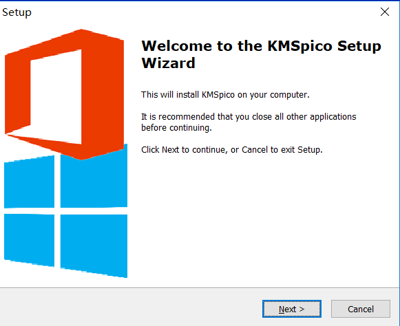
    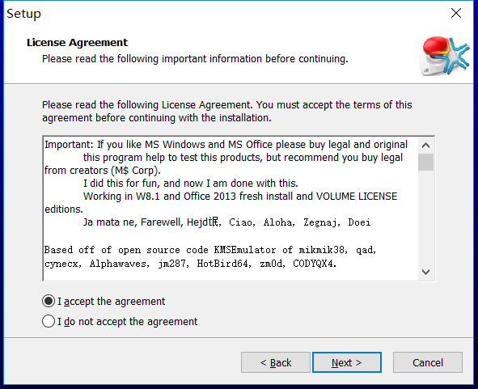
    
    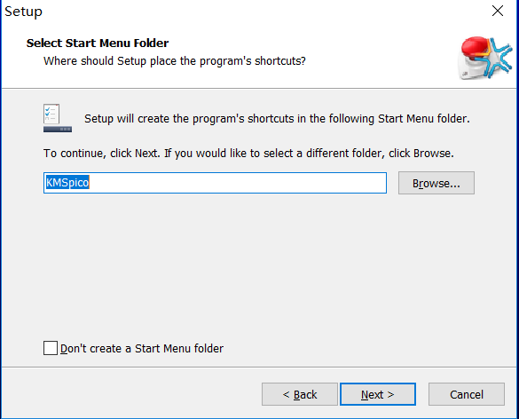
    

5. 之后，找到KMS的安装路径，比如这里是`D:\KMSpico` 。双击打开图标，点击红色按钮，便可以激活windows10和office2016

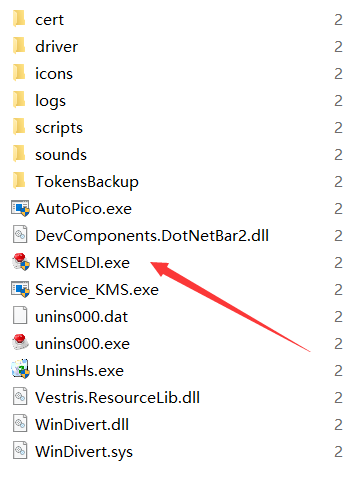

## Office 2019

### 准备

- 进入 Office Tool Plus 官网，下载 Office Tool Lite 安装程序
- 官方使用手册：[地址](https://github.com/YerongAI/OfficeToolPlus/blob/master/Manual/Chinese%20Simplified.md)
- 卸载系统上所有的 Office

### 步骤

1. 打开 Office Tool Lite， 启动安装向导

   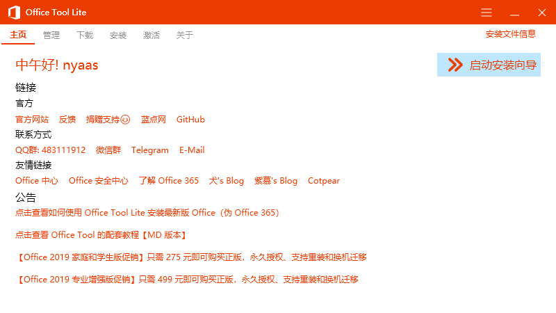

2. 选择需要安装的软件，Office 套件选择 Office 2019 专业增强版 - 批量版，体系架构一般选择64位，Visio 如有需要可选择安装，Project 选择 Project 2019 专业版 - 批量版。

   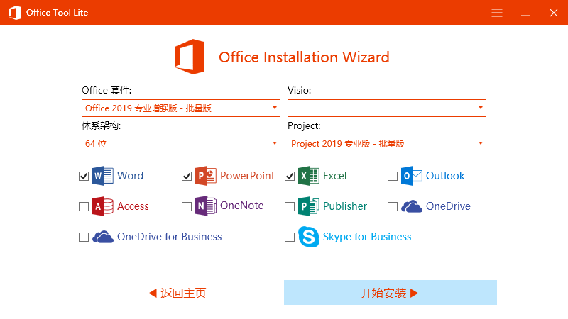

3. 安装完成后进入激活页面，在 KMS 管理填入一个 KMS 地址，填入即可。

   这里提供一些可用的 KMS 服务器
   kms.loli.beer
   kms.loli.cab
   kms.90zm.xyz
   kms.cangshui.net
   kms.03k.org
   kms.myftp.org
   zh.us.to
   kms.chinancce.com
   kms.digiboy.ir
   kms.luody.info
   kms.mrxn.net
   kms8.MSGuides.com
   xykz.f3322.org
   kms.bige0.com
   kms.shuax.com
   kms9.MSGuides.com
   kms.lotro.cc

4. 等待安装完成即可。

#### 注：

若无法自动激活Office，需要以下操作：

1. 在激活页安装 Office Mondo 2016 Volume 证书

   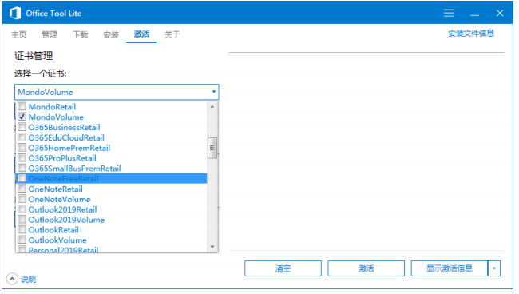

2. 安装产品密钥：从说明中取得 Office Mondo 2016 的 GVLK，并粘贴到密钥框中进行安装。

   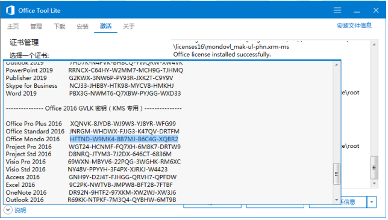

3. 设定 KMS 服务器地址：在 KMS 管理内，输入一个 KMS 地址，并点击 设定服务器地址 按钮，随后点击激活按钮即可。

   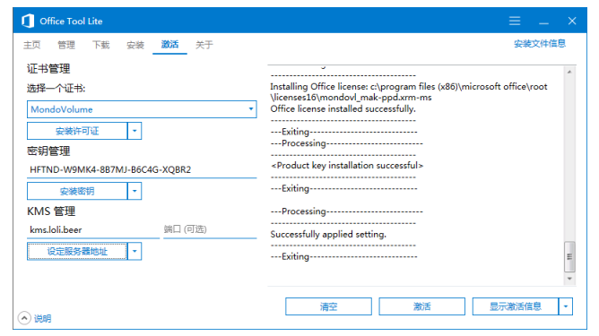

4. 出现此提示即表示 Office 已成功激活。

   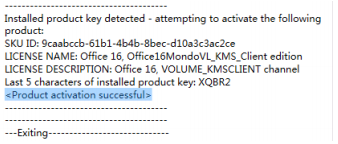

## Office2016

办公必备（家园统一使用Office2016），在家园内部不使用wps。

准备：

1. office2016的镜像（`D:\软件\Office2007-2016`）
2. KMS激活工具（`D:\软件\系统工具集`）
3. 卸载系统上所有的 Office

步骤：

1. 将软件拷贝到个人U盘上
2. 双击打开office2016镜像
    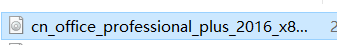
3. 点击setup就开始自动安装了，稍等一段时间之后，就安装完成了

  

4. 安装KMS激活工具并激活——步骤见上

安装失败的原因：

   原来的office未卸载干净

解决办法：

   最快最方便的方法：重装系统。其他方法较为繁琐且具有一定安全性，在此不做介绍，可百度谷歌查找解决办法

#### Office 2010

这里推荐使用一款名为 mini-KMS_Activator_v1.2_Office2010 的软件，可在百度搜索得到，也可在应维机中找到。