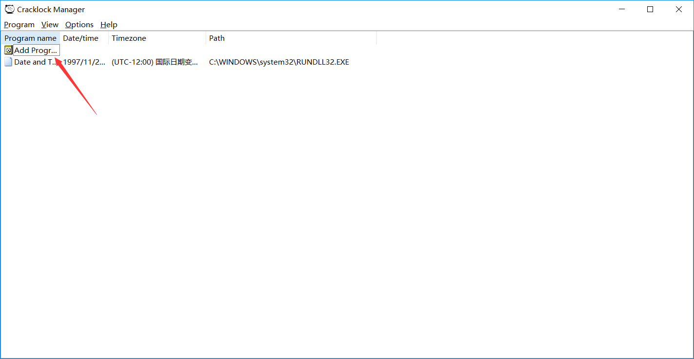

## 其他工具

### MindManager2017

思维导图，只有英文版

准备：

1. 拷贝安装包和注册码（`D:\软件\思维导图-MindManager\MindManager 2017`）

安装（安装图略去）：

1. 双击打开安装包进行安装
2. 安装完成之后需要输入密钥，打开“注册码.txt”复制密钥即可

### Xind Zen

直接去应维机内（`D:\软件\Xmind_Zen`）获取破解版安装包即可

### Cracklock工具

锁定时间工具，破解有试用时间的软件。不保证100%成功。

软件和安装过程就不赘述了，软件目录？

使用：

1. 添加一个程序，必须为可执行文件，如果报错请仔细看报错说明
2. 找到需要锁定的程序，双击之后进入设置
3. 选择需要锁定的时间、锁定时间、确定
4. 每次打开需要从`Crack`中打开，右键选中需要打开的软件，点击`Run`

#### 