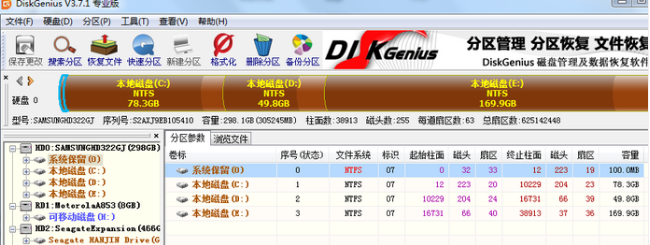
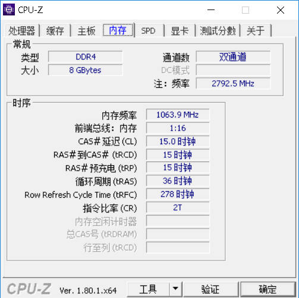
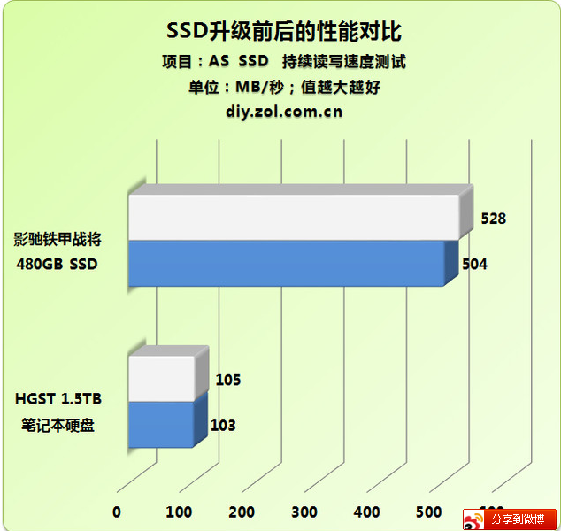

### 电脑常识

#### 分区

分区是一个比较基本的技能：合理分区可以有效管理自己的文件方式。

1. 首先我们在网站上将diskgeniu下载到电脑中，无须进行安装，直接解压到硬盘上就可以直接使用了。以下为软件打开界面。

2. 鼠标双击Disk Genius.exe运行软件后，选择所需要分区的硬盘和硬盘容量大小，以免误分其它硬盘。

3. 运行DiskGenius工具后，选择需要检测与修复的磁盘分区，然后打开【分区】。

   

   4. 里面有各种选项，基本都是比较简单易懂的操作

#### 清灰和日常维护

        大家买的本本都是要用的，那里面的风扇可不会一直闲着，积灰是一个大问题。有的时候用着用着鲁大娘就给你来一个刺耳的警报，这是因为散热器上积灰了导致散热片的进风量大大减少了而无法有效的将热量排出造成的，所以定期对电脑进行简单的维护是比较重要的，这样可以大大延长笔记本使用寿命，减少其出故障的概率。
    
        拆机并不是一个很难的过程，但是并不好在这篇文章里讲述，因为不同的机器的结构不尽相同，简单点的只需要拆一个后盖就能解决，复杂的还要拆键盘面先断开各种排线。所以笔者在此推荐想拆机的筒子们多百度自己电脑型号的拆机图片做到对内部组件的基本了解。
    
        拆完机后，简单的维护就是拆卸内存条用橡皮擦清理金手指上的污渍，清除散热模块上的积灰，更换硅脂。要详细的将真的讲不出。。。：）

#### 笔记本升级

	笔记本的升级是很有限的，在bga封装出现之后，笔记本电脑的cpu就不可更换了，所以CPU上的升级基本不可能了，显卡同理（不排除用mxm接口的显卡，可以更换，但是得注意供电）

所以，这里意义上的升级更多的是指：

**内存上的升级 **

	一般简单粗暴，加钱买内存，就能变得更强（加内存要注意，有些电脑是半载的内存无法升级，而有额外的内存插槽的电脑一定要注意内存的类型这个可以用cpu-z查看

	最重要的是ddr的类型（大小关联不大4+2或者4+8都行），其次是内存频率，理论上不同频率的内存可以混插，但是默认会以低的频率运行

**硬盘上的升级 **

	硬盘的种类大致分为两种：机械硬盘（HDD）和固态硬盘（SSD）
	
	简单做个对比把

	从这些数据上或许不能看出什么细节。
	
	简单的说，SSD并不会从计算性能上来提升电脑的性能（玩游戏不会提高fps之类的）但是，从35s开机到7s开机的提升还是让人可以明显体验到的。但是，一般的中档笔记本只会标配HDD，所以这里的升级便有了意义。
	
	以上两种升级都是得掌握拆机的技巧才能实现的，所以动手能力才是玩机最重要打一个部分，其实提升也很容易，把自己的电脑拆一拆，自然就不会慌了。