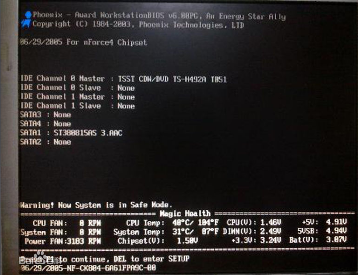
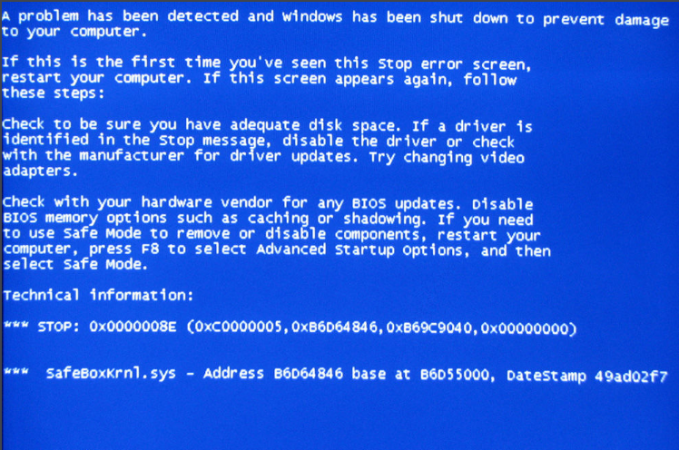
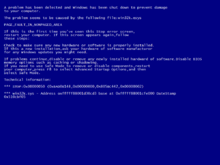

### 基本维修

#### 黑屏与蓝屏

电脑用着用着就突然：

又或者：

那就只有

莫慌，让贫道切逗他一斗

##### 黑屏

- 电脑黑屏是比较容易出现的现象，尤其在一些较老的电脑或组装电脑中。电脑黑屏的故障原因有多种，如显示器损坏、主板损坏、显卡损坏、显卡接触不良、电源损坏、cpu损坏、零部件温度过高等。也有的是人为的造成电脑黑屏，如微软中国的正版验证。

- 2008年10月15日微软内部邮件，微软将针对中国市场在20日启动Windows XP专业版及Office的正版验证计划，届时，安装了盗版Windows XP专业版的电脑将被强行每小时“黑屏”（桌面背景变为纯黑色）一次，Office的菜单栏将被添加“不是正版”的标记，盗版软件的用户将分别遭遇电脑“黑屏”与“提醒标记”等警告。

- 以上来自百度百科对黑屏的定义，所以黑屏了，首先得排除一些硬件上的问题，比如内存条的短路（这是最容易出现的情况，因为内存条的金手指暴露在外又是通电产品，容易积灰造成短路，一般问题不大，用橡皮擦就能搞定），显卡问题等等硬件上的，大多没办法，要么买新要么送修。

##### 蓝屏

- 电脑蓝屏，又叫蓝屏死机（Blue Screen of Death，简称BSOD），是微软的 Windows 系列操作系统在无法从一个系统错误中恢复过来时，为保护电脑数据文件不被破坏而强制显示的屏幕图像。

- Windows操作系统的蓝屏死机提示已经成为标志性的画面。大部分是系统崩溃的现象。

- Windows中有两个蓝底白字图像都被称为蓝屏死机：一种是Windows 9x操作系统发生小故障，一种是Windows NT发生内核错误。由于Windows 9x已退出历史舞台，所以现在一般指后者。

蓝屏相对黑屏出现的问题有很多原因：

1. **错误更新显卡驱动**

   	错误安装或更新显卡驱动后导致电脑蓝屏故障也是主要原因之一。重启电脑按 F8 进入安全模式，在安全模式的控制面板添加删除中把显卡驱动删除干净：然后重启正常进入系统，重新安装显卡驱动或换另一个版本的显卡驱动。强烈推荐使用驱动人生安装或更新显卡驱动，对于部分对电脑了解不多的用户来讲，该软件最适合不过了，一键检测安装，根据用户的电脑型号与配置，推荐安装和电脑兼容的电脑驱动，有效防止用户错误操作使显卡驱动安装错误导致电脑蓝屏故障。

2. **电脑超频过度**

   	超频过度是导致蓝屏的一个主要硬件问题。过度超频，由于进行了超载运算，造成内部运算过多，使 cpu 过热，从而导致系统运算错误。如果既想超频，又不想出现蓝屏，只有做好散热措施了，换个强力风扇，再加上一些硅胶之类的散热材料会好许多。另外，适量超频或干脆不超频也是解决的办法之一。对于多数用户来说一般都不会进行超频操作，所以这点一般不实用。
      	
      	内存条接触不良或内存损坏。
      	
      	在实际的工作中笔者遇见最多的电脑蓝屏现象就是内存条接触不良(主要是由于电脑内部灰尘太多导致，老电脑常发生) 以及硬盘故障导致的电脑蓝屏居多。可尝试打开电脑机箱，将内存条拔出，清理下插槽以及搽干净内存条金手指后再装回去即可。如果问题没解决，确定是内存故障，更换内存条即可。

3. **硬盘出现故障**

   	硬盘出现问题也会导致电脑蓝屏，如硬盘出现坏道，电脑读取数据错误导致蓝屏现象，因为硬盘和内存一样，承载一些数据的存取操作，如存取 / 读取系统文件所在的区域出现坏道，也会造成系统无法正常运行，导致系统或电脑蓝屏。首先检测硬盘坏道情况，如果硬盘出现大量坏道，建议备份数据更换硬盘。如果出现坏到比较少，建议备份数据，重新格式化分区磁盘，懂电脑硬盘的朋友还可以将坏到硬盘区进行隔离操作。之后再重新安装系统即可。

4. **安装的软件存在不兼容**

   	如果电脑之前一直使用正常，在安装了某软件后频繁出现电脑蓝屏，有可能是因为软件不兼容，但这种情况一般很少发生。在确定此前电脑一直正常，安装该软件后常出现电脑蓝屏故障，建议卸载软件试试，如问题未能解决，则可能是其他原因。

5. **电脑中病毒**

   	些病毒木马感染系统文件，造成系统文件错误，或导致系统资源耗尽，也可能造成蓝屏现象的发生。建议重新启动电脑进行杀毒操作，选用目前主流的杀毒软件查杀，如果遇到恶意病毒，建议系统还原或者重装系统。

6. **电脑温度过高**

   	电脑内部硬件温度过高也是电脑蓝屏现象发生比较常见的一种原因，温度过高主要以 cpu 与显卡，硬盘等做重要参考。如果出现电脑蓝屏而电脑内部温度很高，那么很可能就是散热不良导致电脑蓝屏，如果是 cpu 或显卡温度引起，那么开机看 cpu 风扇和显卡风扇是否正常转动，正常的话建议加强主机散热，比如添加机箱散热等，如果是硬盘温度过高，则可能有硬盘故障，需要更换。
      	
      	一旦遇上蓝屏，大多数的人都会以为Windows不行了，所以就瘫痪了，有罪魁祸首是Windows，或者Windows不够强悍、不够稳定的意思。要知道，每当有内核模式设备驱动程序或者子系统引发了一个非法异常，Windows就会面临这个艰难的抉择，虽然Windows最终还是选择了崩溃，但是这并不代表它就不能够忽略该异常，让设备驱动程序或者子系统继续往下执行。

7. **其他原因**

   	如电脑电源出现故障，导致供电不正常，导致经常死机等，还有的是电脑硬件不兼容，这种情况多数出现在新购买的组装电脑上，建议购买组装电脑去选择搭配均衡，兼容性好的硬件搭配。
      	
      	Windows之所以要选择“亡我”，是因为它不知道该错误是否能被隔离出来从而不伤害系统的其它程序与数据，或者该组件将来是否能够恢复正常，而且Windows深知，这个异常更有可能来

   

   	源于更深层的问题，比如由于内存的常规破坏（GeneralCorruption），或者由于硬件设备不能正常工作。允许系统继续运行可能导致更多的异常，而且，存储在磁盘或其他外设中的数据可能也会遭受破坏。Windows意识到，这样做的风险太大了，为了您的程序、[数据安全](https://baike.baidu.com/item/%E6%95%B0%E6%8D%AE%E5%AE%89%E5%85%A8)与完整，为了将您的损失在第一时间减小至最低，Windows于是忍痛做出了自我牺牲。
   	
   	当系统检测到引发崩溃的致命错误时，Windows自己执行崩溃函数“KeBugCheckEx”。该函数接受一个停止代码（STOP Code，也称为错误检查码“Bug Check Code”），以及四个根据停止代码来解释的参数（下文中会有图例）。在调用KeBugCheckEx之后，首先该系统所有[处理器](https://baike.baidu.com/item/%E5%A4%84%E7%90%86%E5%99%A8)上的所有中断将被屏蔽，然后系统将显示器切换到低分辨率的VGA图形模式（因为这是所有Windows平台显卡均支持的通用模式），绘制一个蓝色背景，然后显示此停止代码，并且后面紧跟一些对用户诊断错误有帮助的关键信息。
   	
   	最后，KeBugCheckEx调用所有已注册的设备驱动程序错误检查回调函数（这种回调函数通过调用KeRegisterBugCheckCallback函数来注册），从而让这些驱动程序停止运行它们所支配的设备（有系统数据结构已经被破坏得太严重以至于蓝屏都显示不出来的可能性）。