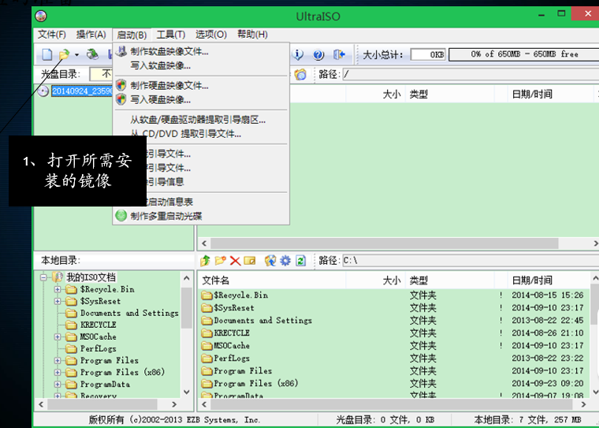
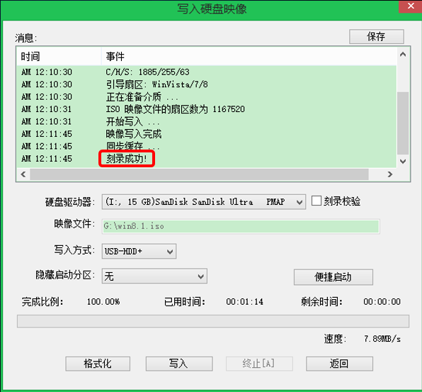
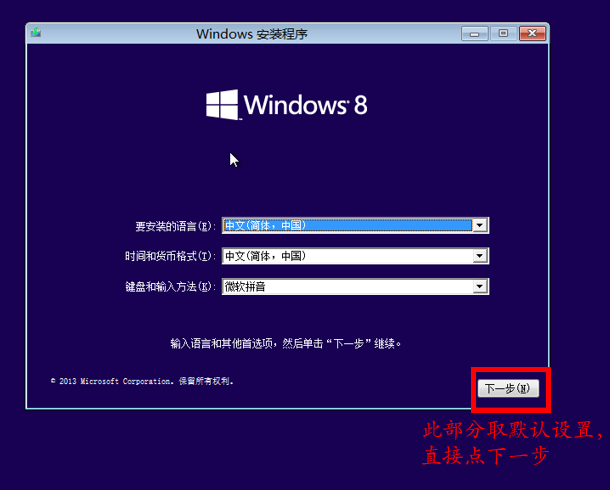
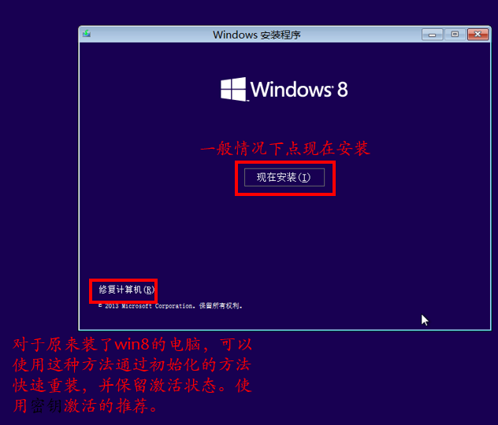
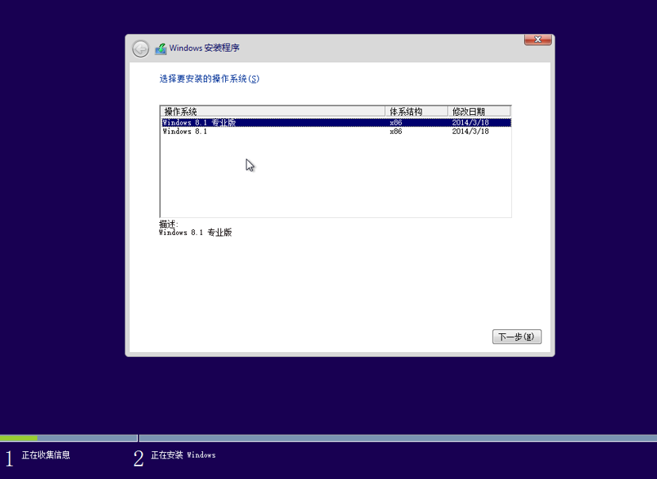
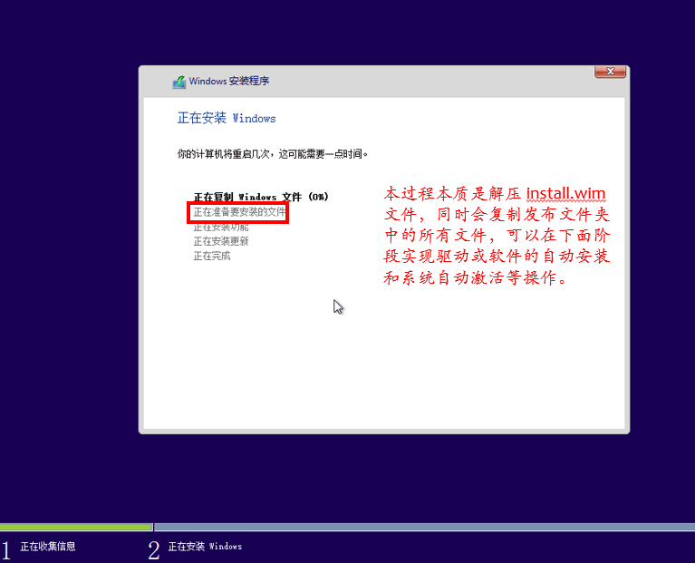

### 重装系统

电脑坏了无非就是重启、重装、重买= =！咳咳……

重装系统是比较基础的东西，学会了就成为了一个合格的备胎，咳咳，又跑偏了

（严肃）

这里简单介绍装系统所用的东西——

1. Windows镜像（或者linux中像ubuntu啊，elementory os啊都行）(一个磁盘上的数据在另一个磁盘上存在一个完全相同的副本即为镜像,这里提到的镜像可以通过百度搜索到安装包,需要下载哪个视你的电脑系统而定,比如Windows10就下载windows10的镜像安装包,常见镜像可以在应维资料机上找到)
2. U盘，最好是容量大于8g的，而且是usb3.0的(usb3.0是一种usb规范,目前市面上的U盘大部分都是usb3.0,usb3.0的传输速度更高,能使主机更好地识别输入设备)
3. 软碟通（应维盘目录？）
4. 你那寂寞难耐的电脑= =b

   准备的东西好了，就可以开工了，按以下顺序制作一个启动盘

**注意**：使用软碟通注意用管理员权限，否则有的时候脸黑别怪我
**注意2**：有的U盘比较玄学，就是刻录不了，换个U盘就行（小概率）

当看见刻录完成后就基本上确定这个启动盘做完了，然后就是装系统的过程了。

部署系统，装逼的装系统方式无疑是用dism命令部署，但是这里不会介绍，只教简单易懂的。对dism有兴趣可自行在网上搜索相关文献。

在部署系统前，很重要的一点是确定自己电脑的启动方式，进入**BIOS（百度）**可以修改电脑的启动方式和启动项，由于各个厂商定制的bios不一样这里不细讲，大致的方式是

找到你的U盘，可以开始装系统了

这里以win8为例，win10和win7同理，xp的话。。。。。让它寿终正寝吧：）

最后等待安装完成并自动重启

**注意：** 重启时要拔掉u盘，或者也可以进bios把启动项调回去，不然会再次进入安装界面

**注意2：** 推荐原来是什么系统就安装什么系统，这样不用担心硬盘格式和启动方式的不兼容带来的各种毛病。当然，老系统装新系统屁事没有。新系统装老系统建议多看看你这台机器的论坛贴吧并寻找相关资料。

但是这样，就万事大吉了么？no！

激活是个大问题，找一个kms激活吧，或者你可以买正版：）(kms是一种新型产品激活机制,目的是为了Microsoft更好地防盗版,通过百度可以找到kms激活工具.)

 

**注意：** 安装好的系统只附带Windows基本驱动，推荐用Windows update来更新驱动，或者也可以用第三方软件来安装。

1. 下载驱动精灵,驱动人生,或360驱动大师等驱动工具
2. 按软件要求正确安装驱动软件,点击一键驱动检测.
3. 系统自动下载驱动,完成后重新启动电脑