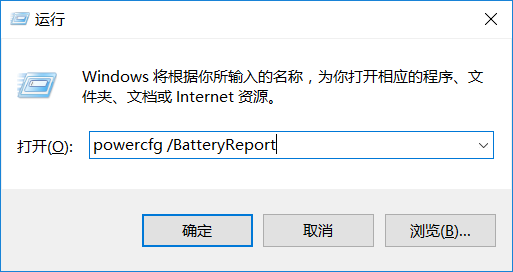
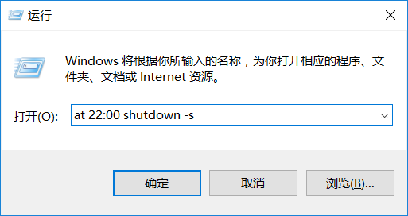
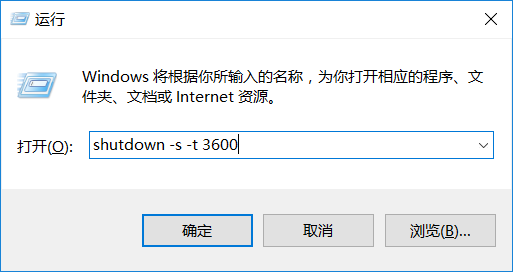
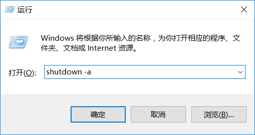

## 一些小技巧

### 查看笔记本电池损耗率

1. Windows + R 
2. 输入`powercfg /BatteryReport`，注意空格
    
3. 回车
4. 在C盘的用户目录下可以找到`battery-report.html`这个网页，打开就能看到关于自己电脑电池的使用情况（页面全英文）

### 自动关机设置

1. Windows + R
2. 输入`at 22:00 shutdown -s `，表示在22点自动关机
   
3. 输入`shutdown -s -t 3600`，表示在60分钟后自动关机
   
4. 输入`shutdown -a`，可以取消关机操作
   