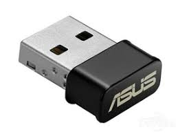

### 基础知识介绍

在机房的一些数据线的用途

注：在这里投影仪可以理解为外接显示器的一种

**VGA线**：

- 连接主机和显示器
- 连接笔记本和外接显示器

**HDMI线**：

- 连接笔记本和外接显示器

**VGA线与HDMI线的区别**：

- 我们可以简单的认为：HDMI线（接口）优于VGA线（接口）
- HDMI线可以声音画面同步连接；VGA线只能显示画面
- 现在的笔记本或者说稍微轻薄一点的笔记本只有HDMI接口，没有VGA接口。VGA接口已经开始逐渐被淘汰，但有些设备目前只有VGA接口所以发明了一种转接线（VGA线转HDMI线）

**说明**：

我们说到HDMI线可以音画同步，那么有的时候我们并不想传输音频只想传输画面，这种情况下我们可以找到右下的音量按钮，右键这个图标在“播放设备"里面进行设置，。（由于系统的不同，可能界面会有所不同）

**HDMI转VGA**：

- 用于接口的转接，一般用于外接显示器。有的电脑可能没有VGA接口，这个时候就需要这样一根线中转连接。

**TypeC转HDMI：**

- 由于很多超极本可能没有HDMI接口，只有TypeC接口。所以在这种情况下可以使用TypeC转HDMI线。

**主机、显示器电源线**：

- 主机和显示器分别需要一根电源线。主机和显示器需要一根VGA线来进行连接

**手机数据线**

我们可以简单认为，TypeC优于MicroUSB数据线（读写数据速度）

- Type-C（快充线）

    

- Micro USB（普通安卓线）

    ​

    

- 苹果数据线

    

**无线网卡**

一般台式机上网只能通过有线进行连接，笔记本则不需要。原因在于笔记本内置了无线网卡，而台式机基本没有内置无线网卡。在机房，我们的主机配上了无线网卡，所以可以跟笔记本一样联wifi上网

